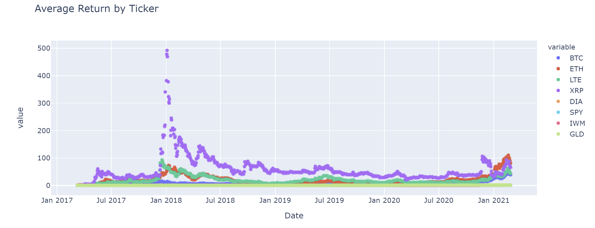
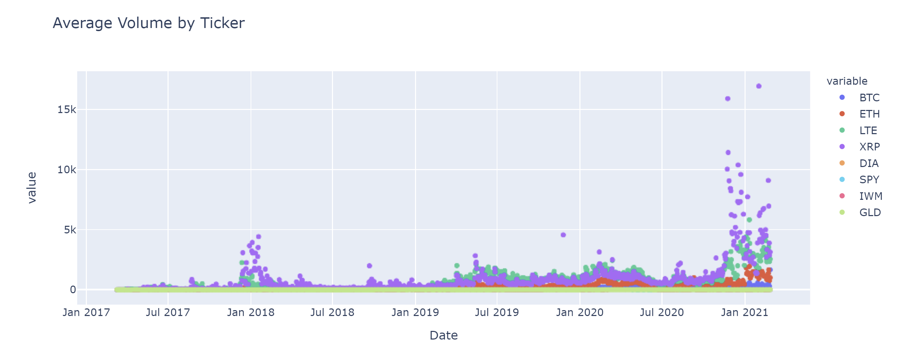
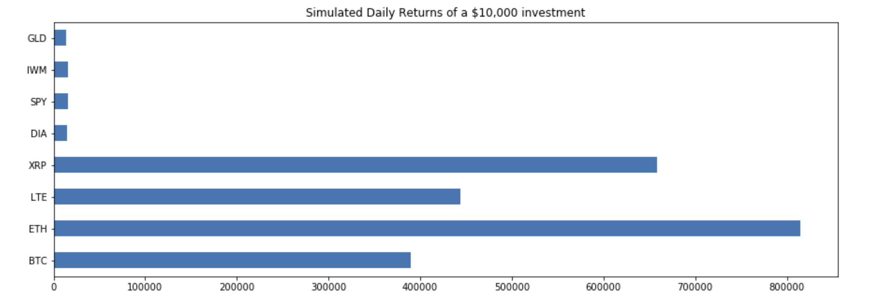
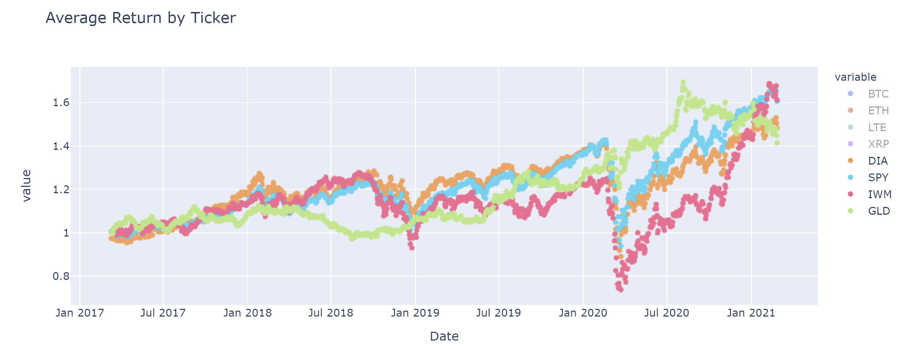
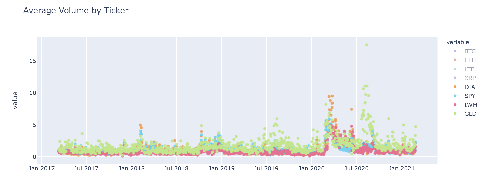
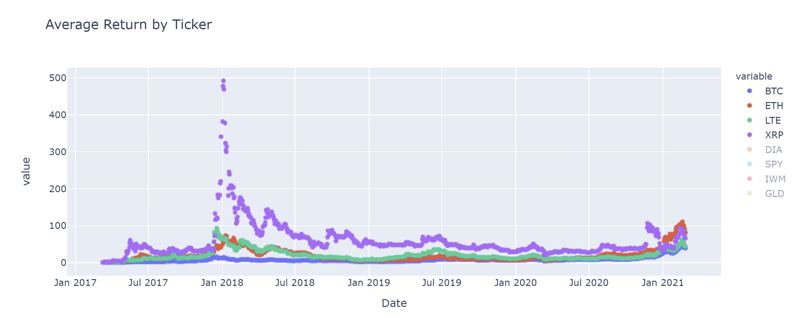
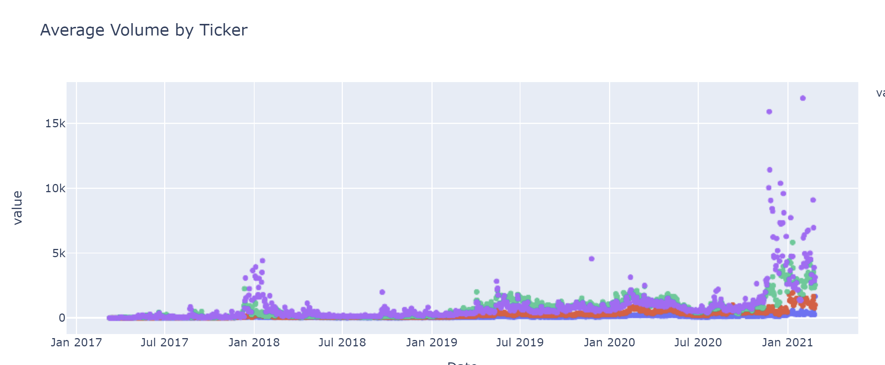

# Project-1

## By: Eric Linn, Lou Donofrio, and Chris Tarker

## Title: Crypto Analysis

## Project Description/ Outline: What moves Crypto Market?

## Questions to answer:

Question 1 - How does volume relate to cryptocurrency and what can it tell us about price movements? (Lou)

Question 2 - What creates volality in the crypto market and how they move in tandem? Are any of the selected coins unvalued, hold, overvaled? (Chris)

Question 3 - Crypto vs stocks: Volume and Returns - Do they correlate? (Eric)

Cyrpto Currency vs. the stock market is an interesting topic and one that is quickly becoming mainstream news. We found this topic intriguing, does the stock market and crypto currency correlate? If so, how do they correlate? We decided to put our hypothesis to the test by looking at 4 of the largest ETF indexes (SPY – S&P 500, DIA – Dow Jones Industrial Average, IWM – Russell 2000, GLD – Gold) and 4 of the most prevalent cryptocurrencies (BTC – Bitcoin, ETH – Ethereum, LTE – Litecoin, and XRP – Ripple) and comparing their average returns and the trading volume over the last 5 years. 

We started by pulling crypto data from Kaggle.com and stock market data from Alpaca. From there we sifted through the data to calculate the average return, average volume and correlation of these assets. Our findings were conclusive, but still left you scratching your head. 

As depicted in the below graphs you can see that cryptocurrencies on average significantly outperformed the overall stock market during the 5 year period. Crypto currency cumulatively averaged ten times what the stock market returned, 576% and 52%, respectively.

The part we found interesting was comparing the average return to the  average volume available. Stock market returns tended to lag as volume rose and the crypto market was a complete 180, in that when the asset prices rose, so did the volume. This begs the question – Why do they move in opposite directions?

In order to compare the two asset classes even further, we calculated the correlation. Our findings we relatively static in that crypto currencies were a complete 180 to the stock market in how they move. One interesting thing to note, is that Bitcoin actually traded more like a stock than any other crypto currency and almost identical to GLD. This is something we would like to dive deeper into in future projects.

