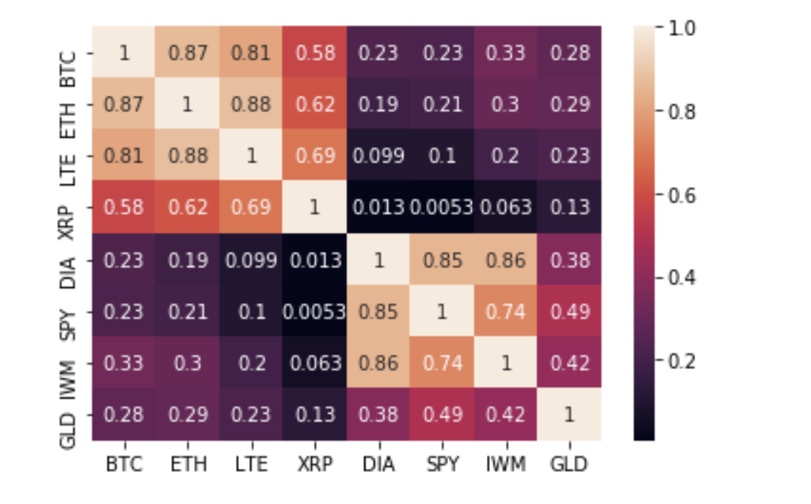

# Project-1

## By: Eric Linn, Lou Donofrio, and Chris Tarker

## Title: Crypto Analysis

## Project Description/ Outline: What moves Crypto Market?

## Questions to answer:

Question 1 - How does volume relate to cryptocurrency and what can it tell us about price movements? (Lou)

Question 2 - What creates volality in the crypto market and how they move in tandem? Are any of the selected coins unvalued, hold, overvaled? (Chris)

Question 3 - Crypto vs stocks: Volume and Returns - Do they correlate? (Eric)

## Data to be used: kaggle free api's and other free data source

## Rough breakdown of tasks: TBD

